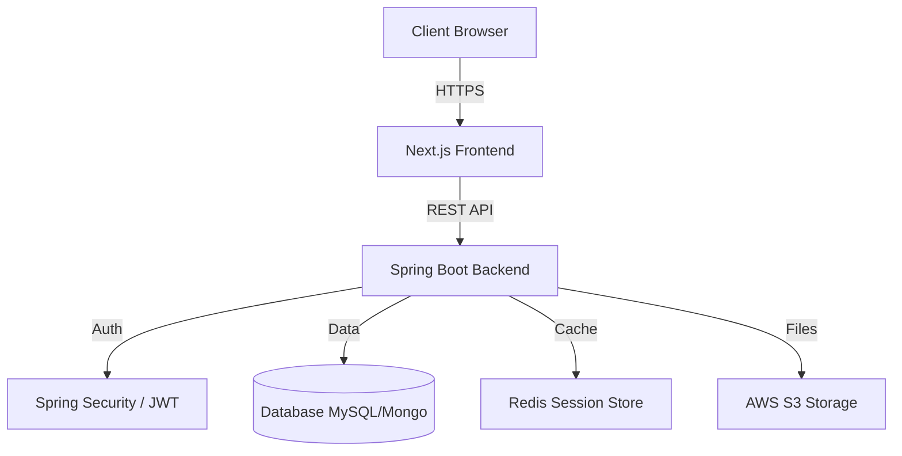

Based on the comprehensive documentation and code configuration files provided, here is a detailed `README.md` for the **Momentum Science Academy** repository.

-----

# Momentum Science Academy Platform

A comprehensive, production-ready digital education platform designed to bridge the gap between students, teachers, and administrators. This monorepo contains the source code for the public-facing website, student learning portal, teacher management interface, and administrative dashboard.

## 📋 Table of Contents

  - [Executive Summary](https://www.google.com/search?q=%23-executive-summary)
  - [Key Features](https://www.google.com/search?q=%23-key-features)
  - [Technology Stack](https://www.google.com/search?q=%23-technology-stack)
  - [System Architecture](https://www.google.com/search?q=%23-system-architecture)
  - [Getting Started](https://www.google.com/search?q=%23-getting-started)
  - [Configuration](https://www.google.com/search?q=%23-configuration)
  - [Project Structure](https://www.google.com/search?q=%23-project-structure)
  - [API Documentation](https://www.google.com/search?q=%23-api-documentation)
  - [License](https://www.google.com/search?q=%23-license)

-----

## 🚀 Executive Summary

Momentum Science Academy is a robust LMS (Learning Management System) featuring a **Role-Based Access Control (RBAC)** architecture. It provides a seamless experience for:

  * **Public Visitors:** To explore programs, faculty, and submit inquiries.
  * **Students:** To access study resources, track performance, and download materials.
  * **Teachers:** To upload resources, track student engagement, and manage content.
  * **Admins:** To oversee users, manage leads, and view platform analytics.

**Current Phase:** Phase 1 (Core Platform & Resource Management) is complete and deployment-ready.

-----

## ✨ Key Features

### 🎓 For Students

  * **Interactive Dashboard:** Personalized view with quick stats, recent resources, and performance tracking.
  * **Resource Library:** Advanced filtering for Past Year Questions (PYQs), Notes, and Assignments by class and exam (JEE/NEET).
  * **Secure Access:** JWT-based authentication with profile management.
  * **Learning Tracking:** Visual progress bars and download history.

### 👨‍🏫 For Teachers

  * **Resource Management:** Drag-and-drop upload interface for educational materials.
  * **Analytics:** Track download counts and student engagement with uploaded content.
  * **Profile Management:** Showcase qualifications and expertise.

### 🛡️ For Administrators

  * **Analytics Dashboard:** High-level metrics on leads, students, teachers, and resource utilization.
  * **User Management:** Full CRUD operations for all user roles, including blocking/unblocking accounts.
  * **Lead Conversion:** CRM-like features to track website inquiries from "New" to "Converted".
  * **Referral System:** Generate and track referral codes to monitor growth.

### 🌐 Public Website

  * **Modern UI:** Responsive Landing, About, Programs, and Faculty pages.
  * **Blog System:** SEO-friendly blog listings with categorization.
  * **Inquiry System:** Integrated contact forms that feed directly into the Admin Lead system.

-----

## 🛠 Technology Stack

### Frontend (`/frontend`)

  * **Framework:** [Next.js 16](https://nextjs.org/) (App Router)
  * **Language:** TypeScript
  * **Styling:** [Tailwind CSS v4](https://tailwindcss.com/)
  * **UI Library:** [shadcn/ui](https://ui.shadcn.com/) (Radix UI)
  * **Animations:** Framer Motion (`motion`), GSAP
  * **State/Forms:** React Hook Form, Zod (Validation), Sonner (Toasts)
  * **Theme:** `next-themes` (Dark/Light mode support)

### Backend (`/backend`)

  * **Framework:** Spring Boot (Java 17+)
  * **Security:** Spring Security + JWT (JSON Web Tokens)
  * **Database Integration:** Spring Data JPA / MySQL (Configured in `pom.xml`)
  * **Utilities:**
      * **Lombok:** Boilerplate reduction.
      * **iText:** PDF generation for reports.
      * **Apache POI:** Excel report generation.
      * **WebSocket:** Real-time updates (configured).

-----

## 🏗 System Architecture

The platform follows a monolithic repository structure with a decoupled Frontend and Backend.



*Note: The documentation references MongoDB, while the current `pom.xml` includes MySQL dependencies. Ensure your database configuration matches your deployment plan.*

-----

## 🏁 Getting Started

### Prerequisites

  * **Node.js** v18+
  * **Java Development Kit (JDK)** 17+
  * **Maven** 3.8+
  * **Database:** MySQL 8.0+ (or MongoDB if following the alternative architecture doc)
  * **Redis** (Optional, for session caching)

### 1\. Clone the Repository

```bash
git clone https://github.com/vishalbarai007/momentum-science-academy.git
cd momentum-science-academy
```

### 2\. Frontend Setup

```bash
cd frontend

# Install dependencies
npm install

# Run development server
npm run dev
```

*The frontend will run on `http://localhost:3000`.*

### 3\. Backend Setup

```bash
cd backend

# Clean and install dependencies
mvn clean install

# Run the Spring Boot application
mvn spring-boot:run
```

*The backend API will run on `http://localhost:8080`.*

-----

## ⚙️ Configuration

### Frontend (`frontend/.env.local`)

Create a `.env.local` file in the `frontend` directory:

```env
NEXT_PUBLIC_API_URL=http://localhost:8080/api/v1
```

### Backend (`backend/src/main/resources/application.properties`)

Configure your database and JWT settings:

```properties
server.port=8080

# Database Configuration (Match your DB choice)
spring.datasource.url=jdbc:mysql://localhost:3306/momentum_db
spring.datasource.username=root
spring.datasource.password=yourpassword

# JWT Security
jwt.secret=YOUR_SECURE_SECRET_KEY_MUST_BE_LONG
jwt.expiration=604800000

# File Upload Limits
spring.servlet.multipart.max-file-size=10MB
spring.servlet.multipart.max-request-size=10MB
```

-----

## 📂 Project Structure

```bash
momentum-academy/
├── backend/                  # Spring Boot Application
│   ├── src/main/java/        # Controllers, Services, Repositories
│   └── src/main/resources/   # Config, Static resources
├── frontend/                 # Next.js Application
│   ├── app/                  # App Router (Pages & Layouts)
│   ├── components/           # Reusable UI Components (shadcn)
│   ├── lib/                  # Utilities (API client, helpers)
│   ├── public/               # Static assets (images, icons)
│   └── documentation/        # Detailed project docs
└── README.md                 # This file
```

-----

## 📖 API Documentation

The backend provides a RESTful API. Full endpoint documentation is available in `frontend/API_ENDPOINTS_COMPLETE.md`.

**Common Endpoints:**

  * `POST /api/v1/auth/login` - User authentication
  * `POST /api/v1/auth/register` - Student registration
  * `GET /api/v1/resources` - Fetch filtered resources
  * `POST /api/v1/teacher/upload` - Upload new materials (Multipart)
  * `GET /api/v1/admin/analytics` - System statistics

-----

## 📄 License

This project is proprietary software developed for Momentum Science Academy. Unauthorized copying, modification, or distribution is strictly prohibited.

-----

**Developed with ❤️ for Momentum Science Academy**
