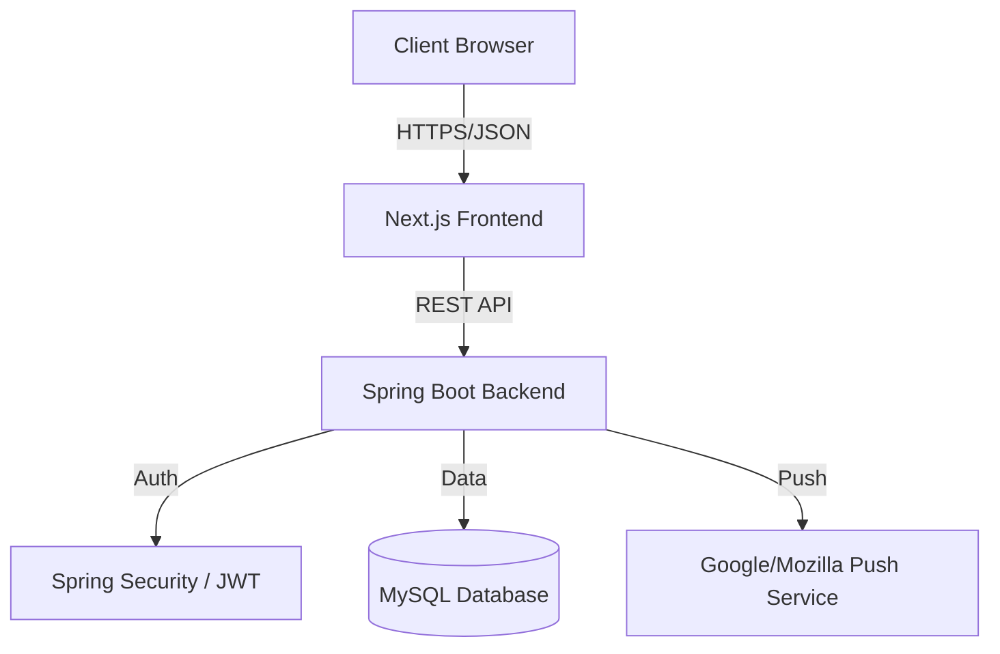

# Momentum Science Academy Platform

A comprehensive, production-ready Learning Management System (LMS) designed to bridge the gap between students, teachers, and administrators. This monorepo contains the source code for the public-facing website, student learning portal, teacher management interface, and administrative dashboard.


## 📋 Table of Contents

- [Executive Summary](#-executive-summary)
- [Key Features](#-key-features)
- [Technology Stack](#-technology-stack)
- [System Architecture](#-system-architecture)
- [Getting Started (Local)](#-getting-started-local)
- [Deployment (Docker/VPS)](#-deployment-dockervps)
- [Configuration](#-configuration)
- [Project Structure](#-project-structure)
- [License](#-license)

---

## 🚀 Executive Summary

Momentum Science Academy is a robust LMS featuring a **Role-Based Access Control (RBAC)** architecture. It provides a seamless experience for:

* **Public Visitors:** To explore programs, faculty, and submit inquiries.
* **Students:** To access study resources, submit assignments, ask doubts, and track performance.
* **Teachers:** To upload resources, create assignments, resolve doubts, and grade submissions.
* **Admins:** To oversee users, manage leads, send notifications, and view platform analytics.

**Current State:** Phase 1 (Core Platform, Assignments, Doubt Resolution & Notifications) is complete.

---

## ✨ Key Features

### 🔔 Hybrid Notification System (New)
* **Dual Delivery:** Notifications are delivered via **In-App Toast/Bell** (when online) and **Web Push** (when offline/browser closed).
* **Smart Targeting:** * *Teacher Uploads Resource* -> Notifies only Students of that Class.
    * *Student Asks Doubt* -> Notifies only Teachers of that Subject.
    * *New Lead* -> Notifies all Admins immediately.

### 🎓 For Students
* **Interactive Dashboard:** Personalized view with pending tasks, recent resources, and performance stats.
* **Assignment Portal:** View due dates, upload submissions (PDF/Link), and receive graded feedback.
* **Doubt Resolution:** Ask subject-specific doubts linked to assignments/resources and get answers from faculty.
* **Resource Library:** Filter content by Class (11/12), Exam (JEE/NEET), and Type (Notes/PYQ).

### 👨‍🏫 For Teachers
* **Content Management:** Drag-and-drop upload for Resources and Assignments.
* **Submission Grading:** View student submissions, assign grades, and provide specific feedback.
* **Doubt Hub:** Centralized dashboard to view and answer incoming doubts from students.
* **Analytics:** Track who downloaded your notes.

### 🛡️ For Administrators
* **Lead CRM:** Track website inquiries from "New" to "Enrolled".
* **User Management:** Full CRUD operations for Students, Teachers, and Admins.
* **System Analytics:** High-level metrics on growth, lead conversion, and platform usage.

---

## 🛠 Technology Stack

### Frontend (`/frontend`)
* **Framework:** [Next.js 16](https://nextjs.org/) (App Router)
* **Language:** TypeScript
* **Styling:** [Tailwind CSS](https://tailwindcss.com/) + [shadcn/ui](https://ui.shadcn.com/)
* **State & Forms:** React Hook Form, Zod, Sonner (Toasts)
* **PWA:** Service Workers for Push Notifications.

### Backend (`/backend`)
* **Framework:** Spring Boot 3.4.1 (Java 17)
* **Security:** Spring Security + JWT (Stateless Auth)
* **Database:** MySQL 8.0 (Spring Data JPA)
* **Notifications:** `web-push` library with BouncyCastle crypto.
* **Build Tool:** Maven

---

## 🏗 System Architecture

The platform follows a monolithic repository structure with a decoupled architecture, fully containerized via Docker.


```mermaid
graph TD
    User[Client Browser] -->|HTTPS/JSON| NextJS[Next.js Frontend]
    NextJS -->|REST API| Spring[Spring Boot Backend]
    Spring -->|Auth| Security[Spring Security / JWT]
    Spring -->|Data| DB[(MySQL Database)]
    Spring -->|Push| VAPID[Google/Mozilla Push Service]

```

---

## 🏁 Getting Started (Local)

### Prerequisites

* **Node.js** v18+
* **Java JDK** 17+
* **MySQL** 8.0+ (Running on port 3306)
* **Maven** 3.8+

### 1. Clone the Repository

```bash
git clone [https://github.com/vishalbarai007/momentum-science-academy.git](https://github.com/vishalbarai007/momentum-science-academy.git)
cd momentum-science-academy

```

### 2. Database Setup

Create a MySQL database named `momentum`:

```sql
CREATE DATABASE momentum;

```

### 3. Backend Setup

```bash
cd backend
# Configure src/main/resources/application.properties with your DB creds
mvn clean install
mvn spring-boot:run

```

*Backend runs on: `http://localhost:8080*`

### 4. Frontend Setup

```bash
cd frontend
npm install
npm run dev

```

*Frontend runs on: `http://localhost:3000*`

---

## 🐳 Deployment (Docker/VPS)

This project is optimized for deployment on VPS (Hostinger/Hetzner/AWS EC2) using Docker Compose.

### 1. Server Prerequisites

* Ubuntu 22.04 / 24.04
* Docker & Docker Compose installed

### 2. Environment Variables (.env)

Create a `.env` file in the project root on your server:

```env
DB_PASSWORD=your_secure_db_password
JWT_SECRET=your_generated_jwt_secret_key
VPS_IP=your.server.ip.address
# Generate VAPID keys using: npx web-push generate-vapid-keys
VAPID_PUBLIC_KEY=your_public_key
VAPID_PRIVATE_KEY=your_private_key

```

### 3. Deploy

```bash
docker compose up -d --build

```

This command spins up **MySQL**, **Backend**, and **Frontend** containers automatically.

---

## ⚙️ Configuration

### Backend (`application.properties`)

Key settings to configure in `backend/src/main/resources/application.properties`:

```properties
# Database
spring.datasource.url=${SPRING_DATASOURCE_URL}
spring.datasource.username=${SPRING_DATASOURCE_USERNAME}
spring.datasource.password=${SPRING_DATASOURCE_PASSWORD}

# JWT
app.jwt.secret=${APP_JWT_SECRET}
app.jwt.expiration-ms=86400000

# Push Notifications (VAPID)
vapid.public.key=${VAPID_PUBLIC_KEY}
vapid.private.key=${VAPID_PRIVATE_KEY}
vapid.subject=mailto:admin@momentum.edu

```

---

## 📂 Project Structure

```bash
momentum-academy/
├── backend/                  # Spring Boot Application
│   ├── src/main/java/        # Controllers, Services, Repositories, Models
│   ├── src/main/resources/   # Config, Static resources
│   └── Dockerfile            # Java Container Config
├── frontend/                 # Next.js Application
│   ├── app/                  # App Router (Admin, Student, Teacher, Public)
│   ├── components/           # Reusable UI Components
│   ├── lib/                  # API Clients & Utils
│   ├── public/               # Service Worker (sw.js) & Assets
│   └── Dockerfile            # Node Container Config
├── docker-compose.yml        # Production Deployment Config
└── README.md                 # This file

```

---

## 📄 License

This project is proprietary software developed for Momentum Science Academy. Unauthorized copying, modification, or distribution is strictly prohibited.

---

**Developed with ❤️ for Momentum Science Academy**
